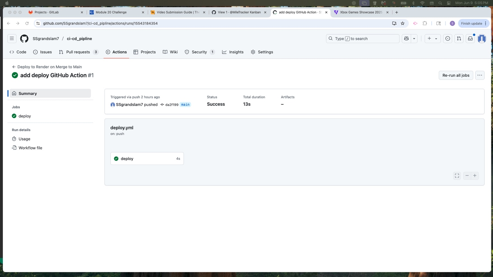

# CI/CD Pipeline with GitHub Actions

## Description

This project demonstrates a complete CI/CD pipeline for a full-stack MERN app using GitHub Actions. The backend is built with Node.js, Express, and MongoDB (hosted on Atlas), and the frontend is built using React (Vite). The pipeline ensures quality through automated testing and deploys to Render on approval.

•	GitHub Repository:
https://github.com/SSgrandslam7/ci-cd_pipline
•	Live App on Render:
https://ci-cd-api-e1qx.onrender.com

---

## Table of Contents

- [Installation](#installation)
- [Usage](#usage)
- [Features](#features)
- [Workflows](#workflows)
- [Credits](#credits)
- [License](#license)

---

## Installation

1. **Clone the repo:**
   ```bash
   git clone https://github.com/SSgrandslam7/ci-cd_pipline.git
   cd ci-cd_pipline
   
2. **Install dependencies:**
    npm install
    cd client && npm install
    cd ../server && npm install

3. **Set up MongoDB Atlas:**
    Create a .env file inside the server/ folder:
    MONGODB_URI=your_mongodb_atlas_connection_string

4. **Seed the database:**
    npm run build    # Compile TypeScript to JS
    npm run seed     # Insert questions into MongoDB Atlas


## Usage
	- Create pull requests to the develop branch.
	-	All PRs run Cypress component tests through GitHub Actions.
	-	Once approved, merge develop into main.
	-	This triggers an automatic deployment to Render via deploy hook.

  

  

  

## Features:
- Cypress component tests on all PRs to `develop`
- Automatic deployment to Render on merges to `main`

## Workflows

✅ .github/workflows/test.yml
	•	Triggered on pull request to develop
	•	Runs Cypress component tests

✅ .github/workflows/deploy.yml
	•	Triggered on push to main
	•	Deploys backend and built frontend to 

## Credits
- Express
- MongoDB
- Apollo Atlas

## License

This project is licensed under the MIT License, 2025, Stephen Schier
  


  